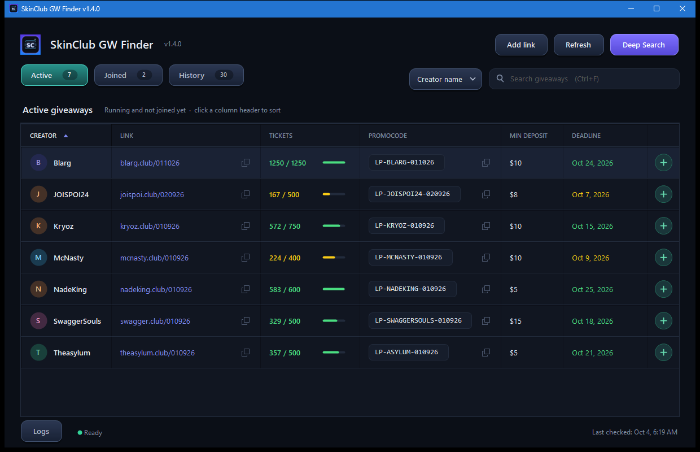

# SkinClub GW Finder

**SkinClub GW Finder** is a Windows desktop app for discovering, validating, tracking, and organizing direct SkinClub creator giveaway links.

It focuses on actual dated giveaway landing pages rather than creator homepages or generic referral links.

> **Unofficial project:** This app is not affiliated with, endorsed by, or sponsored by SkinClub or any creator/partner it discovers.

## Features

- **Deep Search** across public sources, including YouTube, Telegram, web search, and known creator `.club` domains.
- **Direct-page validation** before a giveaway is added to the tracker.
- **Active / Joined / History workflow** for keeping giveaways organized.
- **History limit:** keeps the 30 most recent entries by the time they entered History (falling back to last checked for older data). Excess entries are removed automatically on load and save; Joined giveaways are preserved.
- **Joined exclusivity:** joining a giveaway removes it from Active or History and shows it only in Joined. Removing it from Joined restores it to its real Active/History state.
- **Ticket tracking** with `remaining / total` values when available.
- **Deadline parsing** with clean uppercase calendar dates.
- **Sorting** by creator, URL, tickets remaining, and deadline.
- **Filtering/search** by creator name, all fields, URL, ticket count, or deadline.
- **Copy and open actions** for direct giveaway links.
- **Automatic refresh** every 10 minutes, plus manual Refresh.
- **Persistent local data** between launches.
- **Bounded browser usage:** one rendered page at a time, capped at five app-owned browser processes total. The complete process group is terminated and checked after each page, even if the original browser process already exited. Rendering has a 30-second timeout and an independent 45-second cleanup watchdog.
- **Logs tab:** live page checks, render queue, browser launches, results, failures, and confirmed cleanup. Shows the current browser process count and queued pages, with Copy/Clear actions and a bounded 2,000-event session history.

## Validation

For downloads, use [GitHub Releases](https://github.com/Smokianlord/SkinClub-GW-Finder/releases). Extract the Windows ZIP, close older copies, and run `SkinClubGWFinder.exe`. Requires Windows 10/11, .NET Framework 4.8, and Edge or Chrome for rendered-page metadata. No installer is needed; builds are unsigned.

Saved data lives in `%LOCALAPPDATA%\SkinClub GW Finder\data.json`. Back it up before upgrading if you need all older History entries: v1.3.0 automatically keeps only the 30 most recent History giveaways. Joined entries are preserved.

Run `BUILD_EXE.bat` to compile and launch the app. Run `powershell -ExecutionPolicy Bypass -File scripts/package-release.ps1` to create release assets without launching it. Assets and upload instructions are written to `dist/v1.4.0/`.

Run `tests/run.ps1` for UI and persistence checks, `tests/run-browser.ps1` for process limits and cleanup checks, and `tests/run-live.ps1` to validate the four real September 2026 giveaway links. Live tests make network requests and can fail if those pages change or become unavailable. Tests do not modify your saved giveaways.

